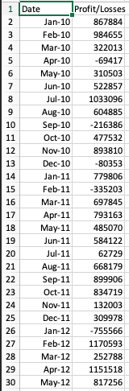
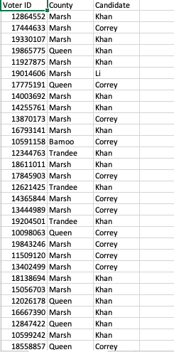

# python-challenge
Using python, this assignment will process massive CSVs of election and finance data to summarize their respective results.

## Getting Started
### Installing
1) Git clone the repository to your local machine:
    ````
    $ git clone https://github.com/markgat/python-challenge.git
    ````
## Running
1) Within the local repository, enter either PyBank or PyPoll folder, and run the respective ````main.py```` program to allow for summary analysis of entries within ````Resources````. The summary will be returned within the terminal where the program is executed.
2) A text folder ````analysis.txt```` will also be saved in the same folder as ````main.py```` that contains the same text as the returned summarization.
## Data
### Original Data (Finance)
86 Entries of net monthly profit/loss preceded by date of record. Entries recorded in monthly periods.


### Original Data (Election)
A whopping collection of 460,997 votes for an election of 4 candidates. Votes listed by voter ID, regional county, and candidate voted for.


### Output Data